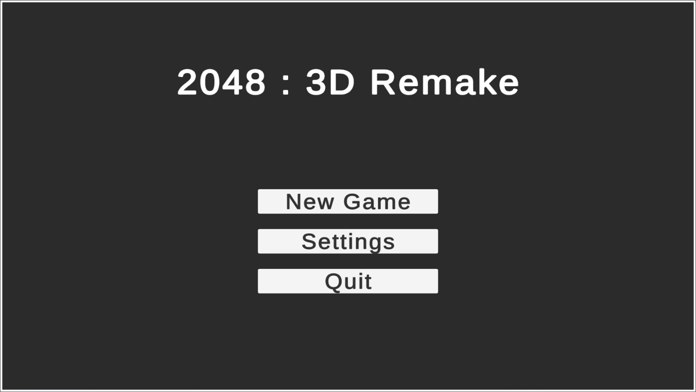
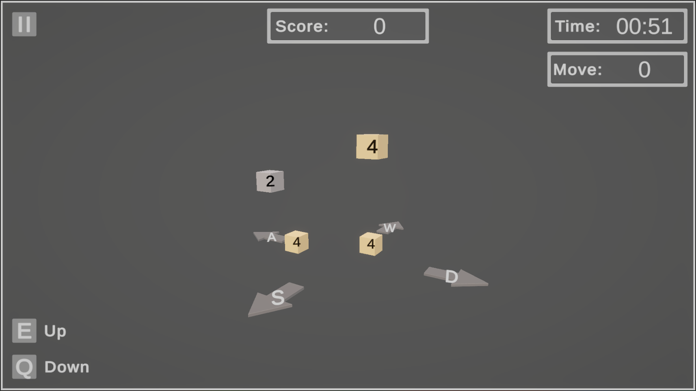
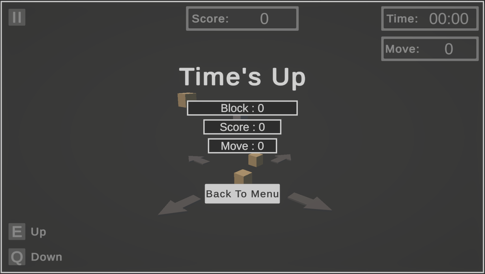

# 2048 : 3D Remake

A 3D version of **2048**, with 4 new game modes and more customisation options.

Everything is under construction, but already playable.

Only keyboard control is supported at the moment, but PS and Xbox controllers will be supported in the future.

## Screenshots

Main Menu

In Game

Time's Up Screen

## License

**2048 : 3D Remake** is licensed under the [MIT license](./LICENSE)
